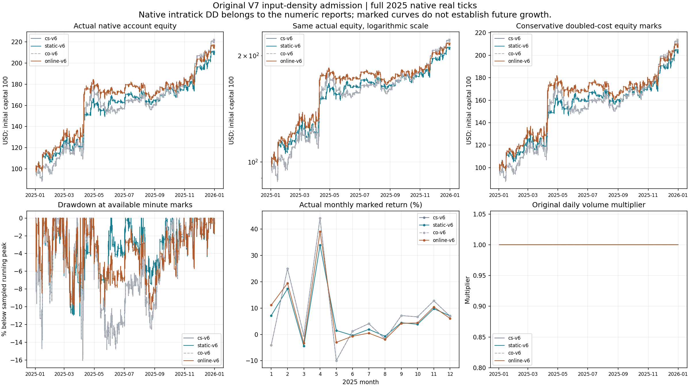

# V7 input-density admission: complete native selection

Both learned roles lower drawdown and improve robust recovery, but earn less than the adjacent original V7 controls. Neither passes the prospectively required actual-wealth and 5% conservative-net improvements. There is no finalist and no 2026 confirmation run. This completes the fixed density bundle; it does not end the user-authorized V7 development objective.

All four V6 paths use full 2025, $100 initial capital, 1:100 leverage and 100% native real ticks on US30/US100/US500. The same 800 consumed inputs, 12 historical bar streams, contracts, platform build 6182 and symbol database remain unchanged. All paths end flat with no EA or learning fault and complete economic reconciliation.

| Role | Actual net | Conservative net | Native equity DD | Robust recovery | Closed lifecycles |
|---|---:|---:|---:|---:|---:|
| Original controls cs-v6/co-v6 | $121.390 | $112.9880 | 16.0732% | 3.98259 | 554 |
| Static ONNX | $110.210 | $103.9370 | 11.0544% | 5.90887 | 406 |
| Online ONNX + EM | $116.120 | $109.0225 | 10.3712% | 5.31713 | 466 |

Conservative net includes doubled costs and removes positive swap credits. Both halves of 2025 are positive in actual and conservative realized and marked changes. Static records 942 forecasts and 528 abstentions; online records 834 forecasts, 347 abstentions and 4,971 actual ONNX-assisted updates from 4,972 committed observations. Every update uses observations strictly older than its forecast. The final unapplied observation has no subsequent forecast and is not an unresolved trade. Checkpoint readbacks succeed, but an actual process restart was not demonstrated.

Every native daily volume multiplier stays at 1. The positive profits and rising equity curves do not demonstrate lot compounding or hockey-stick growth. The two original controls have identical complete equity, exit and research ledgers; one event detail differs only in a host reconciliation wait of 16 versus 0 milliseconds. The conservative curve is sampled at available minute marks; native intratick DD remains the numeric authority.

CPU-only ONNX creation/run and a child-process-only CUDA visibility setting now complete initialization, inference and release. Static creation takes 78.687 seconds and release 15 milliseconds; online creation takes 172 milliseconds and release 16 milliseconds. These observations do not establish the cause of earlier host waits. Earlier partial attempts, the complete V5 capacity correction, compile snapshots, models, settings and reports remain preserved. No old matrix was mixed into the final selection and no failed capacity record was rewritten.

The prospective measured storage amendment caps this runtime at 4 GiB, raw artifacts at 1 GiB and source at 32 MiB while retaining a 30 GiB free reserve. All 50 observations across the four final native paths satisfy reserve, caps and full remaining funding. Live-Dev and Lab remain unchanged. Closed density models, thresholds, features, EM steps, source windows and sizing/exit variants receive no adjacent rescue or retained seed.

Evidence: [selection](../evidence/NATIVE_SELECTION_RESULT_V1.json), [static interpretation](../evidence/ROOT_STATIC_NATIVE_V6.json), [online interpretation](../evidence/ROOT_ONLINE_NATIVE_V6.json), [whole input freeze](../evidence/SELECTION_INPUT_FREEZE_V6.json).
