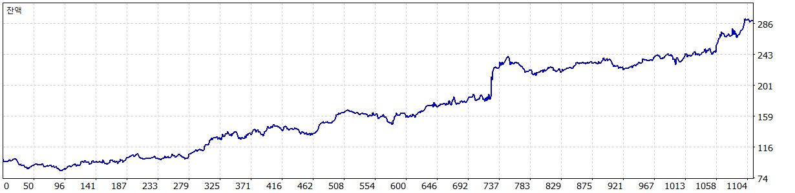

# V7 native ONNX and online learning result

The isolated learner completed actual ONNX forecasts and online updates while retaining the original V7's complete native trading results. This establishes a functioning learning implementation. It does not establish better predictions or improved compound growth.

| Full 2024–2025 native result | Exact V7 control | Observational learner |
|---|---:|---:|
| Initial capital | $100 | $100 |
| Actual net profit | $190.640 | $190.640 |
| Net profit with doubled costs | $173.272 | $173.272 |
| Maximum native equity DD | 19.502399843% | 19.502399843% |
| Completed trades | 1,111 | 1,111 |
| Robust recovery | 6.417481481 | 6.417481481 |

Both roles used the same dedicated build 6182 Portable, 1:100 leverage, Model 4 and complete real ticks for US30, US100 and US500. Each processed 265,669,627 ticks across the required symbols. All 208 binding platform, symbol and historical-input files stayed unchanged before, between and after the final pair. All frozen source/model/EX5/SET files stayed unchanged. Every matched BIRTH/CLOSE economic endpoint and the native START/END contract and swap fields matched.

There were no partial lifecycle records, dropped records, native tick/history faults or trading faults. The original 12 complete zero-range data classifications remained visible in both roles. Earlier platform and input preparation attempts are separately archived and excluded from the comparison.

## Learning evidence

- 1,111 unique accepted-entry forecasts, 1,111 complete own-close labels and 1,111 online updates.
- No active entry or pending label at completion; no model or learning-record errors.
- No update at or before its label availability time, and no forecast used a label from the same or a later second.
- Every forecast and label joins its own native BIRTH/CLOSE position identifier. The largest raw-label discrepancy from the rounded ledger is below 0.000000000001.
- The complete 1,811,848-byte event tape and final alternating checkpoints are preserved.

Clipped-target prediction MSE was **0.085150866**, compared with **0.083415738** for a constant zero forecast: about **2.08% worse**. The learned weights changed, but this result does not support activating those forecasts as a trading filter or sizing rule.

## Temporal results

| Epoch | Trades | Actual net | Doubled-cost net |
|---|---:|---:|---:|
| 2024 H1 | 288 | $11.630 | $6.9795 |
| 2024 H2 | 266 | $51.120 | $47.6835 |
| 2025 H1 | 290 | $61.760 | $56.7715 |
| 2025 H2 | 267 | $66.130 | $61.8375 |

These are identical for both roles and retain actual original V7 sizing changes. The native balance chart below is indexed by trade count. Its growth belongs to the original V7; the observational learner adds no profit to it.

The campaign is closed and frozen. No candidate 2026 values, Live changes or promotion occurred. The broader user-authorized V7 development remains active, with a fresh economic contract required for a materially distinct successor. Detailed authority and evidence are in `optimization/campaigns/v7-native-onnx-online-learning-v1/evidence/NATIVE_PAIR_RESULTS_V1.json` and `optimization/campaigns/v7-native-onnx-online-learning-v1/evidence/CLOSURE_V1.json`.
