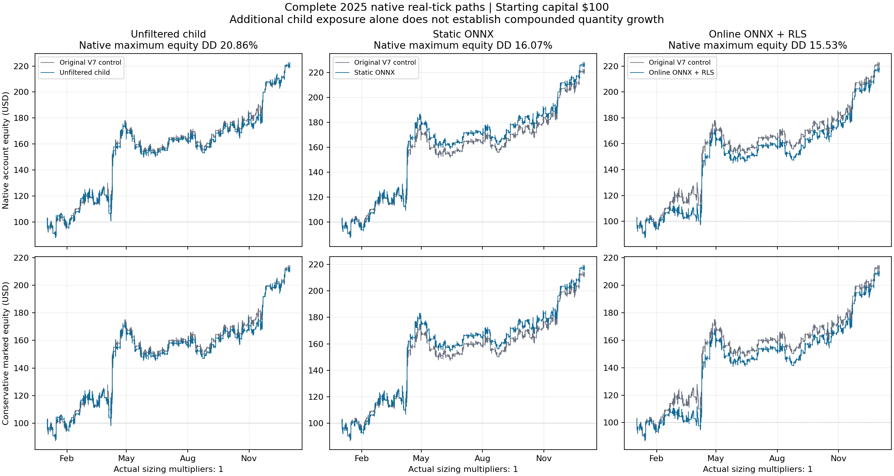

# V7 winner-child ONNX / online learning native result

The complete fixed six-path 2025 bundle has no eligible learned finalist. All paths started with $100, leverage 1:100, and used 100% native real ticks on US30, US100 and US500. Three adjacent original-V7 controls reproduced identical complete economic ledgers.

| Role | Actual net | Conservative net, doubled costs | Native equity DD | Robust recovery | Children |
|---|---:|---:|---:|---:|---:|
| Original V7, each control | $121.39 | $112.988 | 16.0732% | 3.9826 | 0 |
| Unfiltered reference | $120.95 | $111.881 | 20.8601% | 3.9650 | 50 |
| Static ONNX | $126.62 | $117.869 | 16.0653% | 3.9224 | 19 |
| Online ONNX + RLS | $117.56 | $108.959 | 15.5348% | 3.9613 | 17 |

Static improves actual profit and roughly preserves DD, but conservative profit gains about 4.32%, below the fixed 5% requirement. Its robust recovery falls, only three children open in the second half, and second-half child conservative profit is -$0.050. Online reduces DD, but loses actual and conservative profit versus its control; its first-half child conservative profit is -$3.051. These failures leave no candidate for the conditional 2026 confirmation.

All original sizing multipliers remain 1, and every child enters at 0.01 lots. Shared-account blocking and child costs are included in these native results. Reinvestment through larger quantities and hockey-stick compound growth are not established.

Static executes 64 ONNX forecasts. Online executes 76 forecasts and 75 strictly delayed RLS updates using its own completed native shadow labels. Its last completed label has no later forecast at which to be consumed. All actual children and shadow paths finish, with zero unresolved marks or EA faults. Checkpoint write/readback is exercised; these fresh runs do not establish restart behavior.

The four clean compile-v7 assemblies, exact graph and initial 2024 fit remain fixed under the 854-file V4 input freeze. All twelve past bar streams, contracts, build and full native input bytes remain unchanged. Original V7's eight complete zero-range observations are classified by its unchanged rules, with no short history or invalid tick. Every prior history/zero-spread engineering correction is preserved.

Nine native attempts retain 218 archived artifacts totaling 508,764,257 bytes, in addition to their manifests and source/model/history evidence. All 114 native storage observations satisfy the 30 GiB floor and funded caps. Cache deletion was blocked by automatic approval review; no file was deleted. Live-Dev and Lab remain untouched.

The immutable decision is in `evidence/CLOSURE_V1.json`, with complete numeric comparisons in `evidence/NATIVE_SELECTION_RESULT_V1.json` and root interpretation in `evidence/ROOT_NATIVE_EVIDENCE_V1.json`. The fixed bundle is closed without retuning or a retained model seed. Existing V7 improvement continues through a new whole-program comparison.
