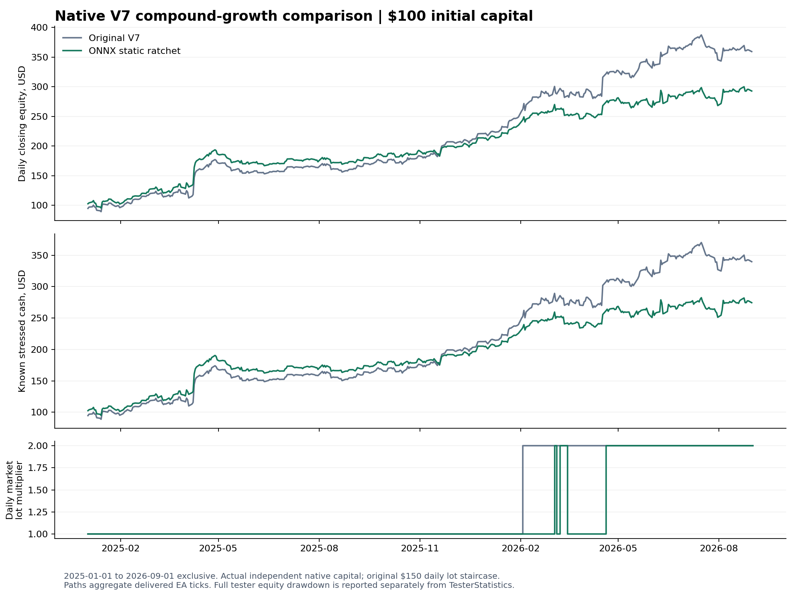

# V7 ONNX 변동성 손절선 실험 결과

동일한 실제 틱 입력으로 2025년 1월부터 2026년 8월까지 비교했습니다. 이번 후보는 DD를 낮췄지만 수익과 복리 성장 기준에 미달해 채택하지 않습니다.

| 항목 | 기존 V7 | ONNX 후보 |
|---|---:|---:|
| 시작 자본 | $100 | $100 |
| 최종 실제 자본 | $359.17 | $292.65 |
| 비용 2배 가정 순수익 | $239.71 | $174.45 |
| 최대 상대 자산 DD | 16.07% | 14.90% |
| 보수적 회복 지표 | 4.65 | 4.48 |
| 완료 거래 | 926 | 939 |

후보의 비용 2배 순수익은 27.23% 감소했습니다. 네 기간의 후보 손익은 모두 양수였지만, 2026년 상반기 수익이 기존 V7보다 작았습니다. 기존 V7은 2026년 2월 3일부터 로트 2배를 유지했고, 후보는 3월에 2배에 도달한 뒤 두 번 1배로 내려갔다가 4월 20일부터 2배를 유지했습니다. 이 그래프는 실제 독립 계좌의 자본·로트 경로이며 과거 손익을 단순 배율로 확대한 값이 아닙니다.

ONNX 예측 76,716회와 손절선 조정 1,021회가 완료됐으며 모델 오류, 미확정 조정, 거부는 모두 0건입니다. 온라인 학습형은 앞선 동일 조건 선별에서 고정 모델에 뒤져 최종 후보가 되지 않았습니다. 이번 결과를 보고 온라인형이나 인접 조건으로 바꿔 재시도하지 않습니다.

실행 전·사이·후의 세 종목 전체 분봉과 시험에 사용된 월별 틱, 플랫폼, 종목 계약, 소스·모델·설정이 일치했습니다. 현재 연도/월 컨테이너 갱신으로 제외했던 초기 대조군 두 번은 별도 보존했고 최종 비교에 사용하지 않았습니다.

Live-Dev는 변경하지 않았습니다. 약 43GiB 여유 공간을 유지하면서 다음의 독립된 V7 개발 방향을 다시 비교합니다.
